### 15 docker commands explanation with screenshot

#### 1. docker run - to start a container
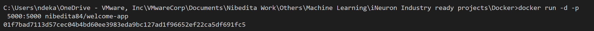

#### 2. docker build - to build a docker image
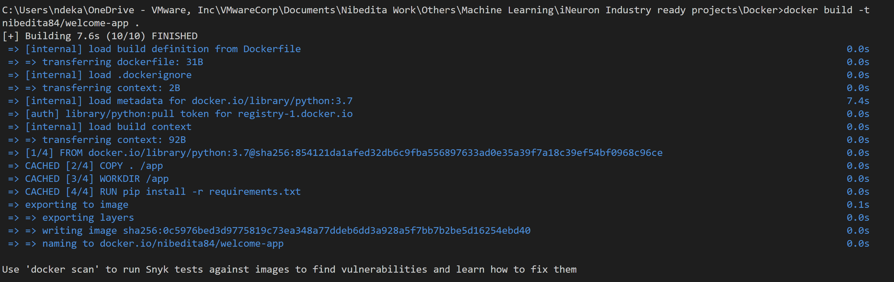

#### 3. docker ps - to show list of docker containers running currently
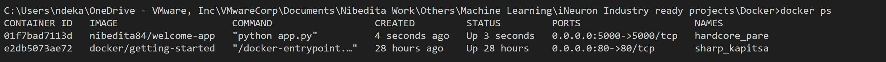

#### 4. docker rmi - to  delete or remove an existing docker image
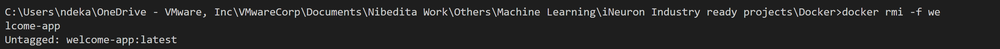

#### 5. docker images - to view the various docker images present in our machine
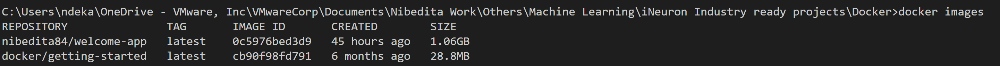

#### 6. docker pull - to pull a docker image to local host
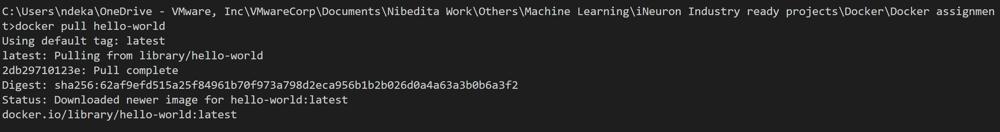

#### 7. docker push - to push an existing docker image from local machine to docker hub to be able to share with others
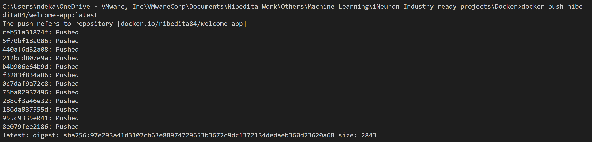

#### 8. docker logout - to logout of the docker account
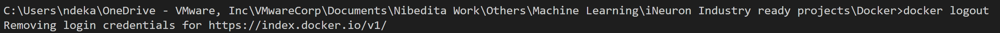

#### 9. docker login - to login to docker account
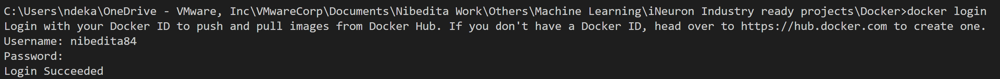

#### 10. docker --version - to show the current version of docker
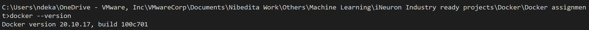

#### 11. docker pause - to pause all processes within one or more active containers
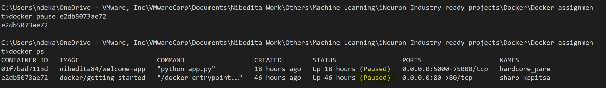

#### 12. docker stop - to stop containers running currently
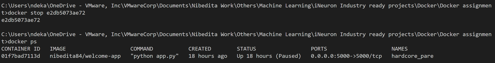

#### 13.  docker history - to show the history of an image
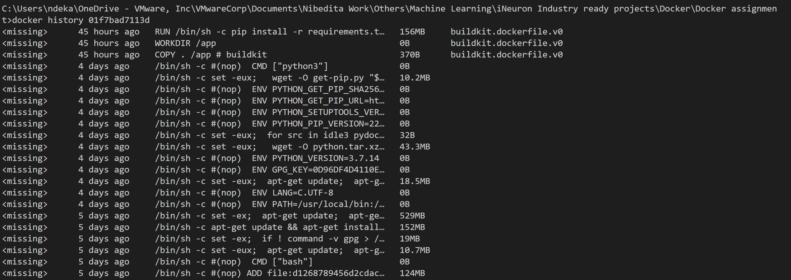

#### 14.  docker info - this command displays system wide information
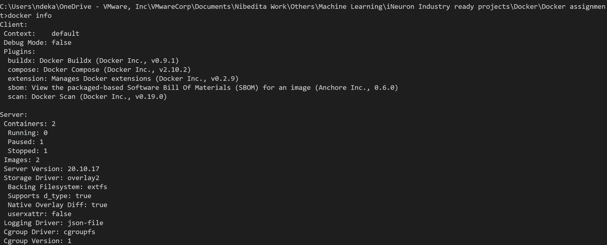

#### 15. docker restart - to restart one or more containers 
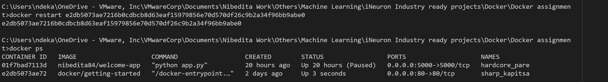