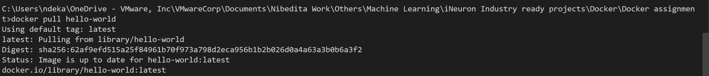
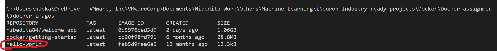
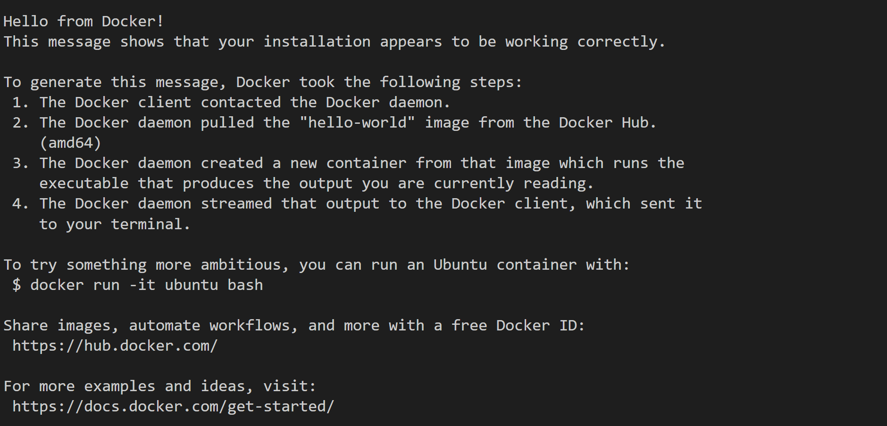

## Running hello world docker image locallydocker

#### Steps:
##### a. pull the docker image to local system

##### b. run the docker image by giving port details

##### link to the github repository where the hello world docker image sits
https://hub.docker.com/u/nibedita84 

